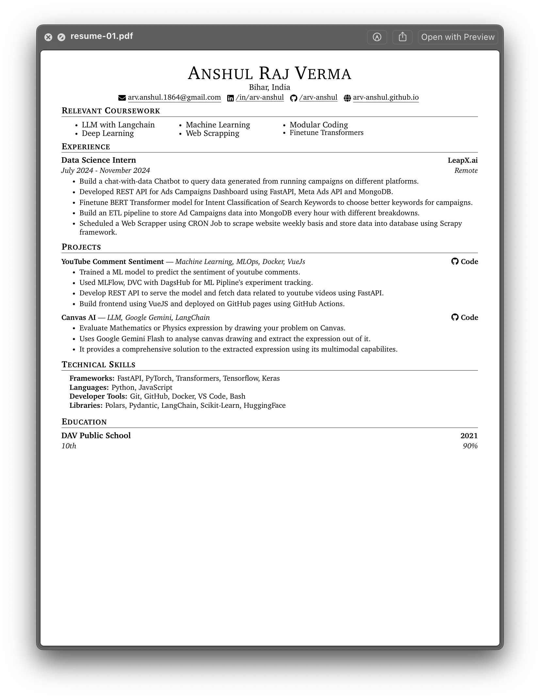
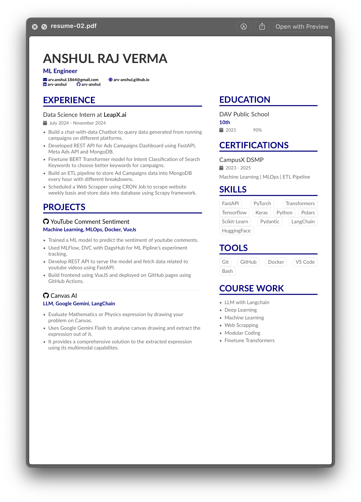

# Resume Generator

Write your details in [`resume.json`] and generate your CV using `python` script. _(Isn't it simple)_

After generating the final `output.tex` file you can go to platforms like [overleaf.com] to render it in PDF format to
see the final result and make changes here and there according to your need and download it.

## Usage

1. Fill [`resume.json`] with your details.
2. There are multiple CV's that you can generate using same `resume.json` by just using Python. Just choose one and run
   below command to generate `output.tex` file in respective directory.
   ```bash
   python run resume-01/generate.py
   ```
3. Copy the contents of generated `output.tex` and paste it to [overleaf.com] (or your know platform) to render it as
   PDF and make changes as you want.

> \[!CAUTION\]
>
> Some resume might require extra packages like [resume-02](resume-02/) require both `output.tex` and `altacv.cls` to
> build successfully. So you need to copy both the files on the platform ([overleaf.com]).

4. Download the rendered PDF and you are ready to send it in Job applications.

## Preview

|               Resume 01                |               Resume 02                |
| :------------------------------------: | :------------------------------------: |
|  |  |

## PDF Rendering with Docker

I have first decided to write a `Dockerfile` which render the `output.tex` into `.pdf` format but there are two
situations I have encountered which stopped me for doing this:

1. Although, I have successfully completed the `Dockerfile` which render the `output.tex` in `.pdf` format but I
   **couldn't satisfied with its build time and image size** because it is too much.
2. I realized that even after generating the `output.tex` from [`resume.json`]; I highly recommend you to look into its
   final content on platforms like [overleaf.com] and further edit your Resume/CV according job description and your
   expectation.

## Acknowledgements

- I have used a modified version of [@sb2nov]'s resume.
- I use [overleaf.com] to render, edit and download the TeX files.
- Thanks to the LaTeX community for the great tools and resources.
- Inspired by various LaTeX resume templates.

## License

This project is licensed under the [MIT License](LICENSE).

[@sb2nov]: https://github.com/sb2nov/resume
[`resume.json`]: resume.json
[overleaf.com]: https://overleaf.com
