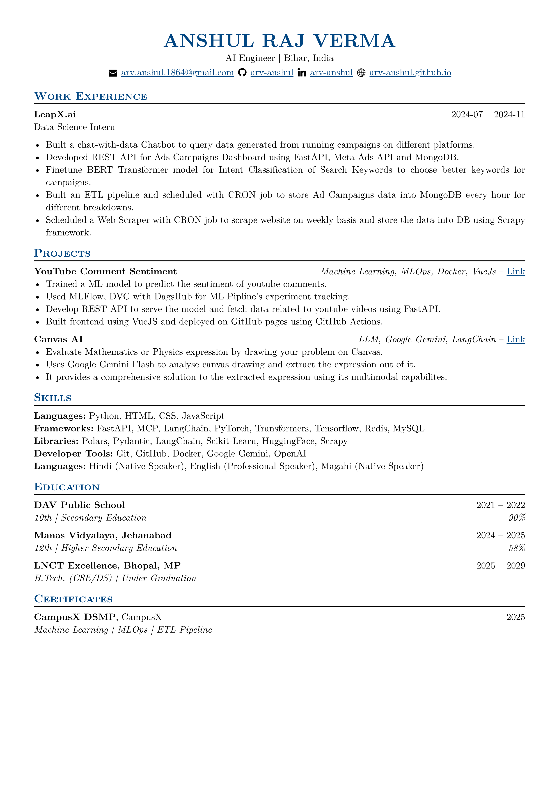

# Resume Generator - Typst

A [Typst][typst]-based resume generator that creates professional CVs from a simple [JSON file][resume.json] with a
single command.

## Usage

1. Clone the repository.

```bash
git clone https://github.com/arv-anshul/resume
```

2. Edit and fill [`resume.json`][resume.json] with your details.
3. Install [Typst][typst] and run `typst` CLI command in your terminal.

```bash
# Compile `templates/basic.typ` as `pdf/basic.pdf`
typst compile \
  --root=. \
  --format=pdf \
  --ignore-system-fonts \
  --font-path=assets/fonts/ \
  templates/basic.typ \
  pdf/basic.pdf
```

```bash
# Compile `templates/vantage.typ` as `pdf/vantage.pdf`
typst compile \
  --root=. \
  --format=pdf \
  --ignore-system-fonts \
  --font-path=assets/fonts/ \
  templates/vantage.typ \
  pdf/vantage.pdf
```

4. Now the compiled PDFs is ready to share in your Job application.

## Preview

### Basic Resume



### Vantage Resume


## Acknowledgments

- The [Typst][typst] project.
- Typst templates: [basic-resume](https://typst.app/universe/package/basic-resume),
  [fantastic-cv](https://typst.app/universe/package/fantastic-cv),
  [vantage-cv](https://typst.app/universe/package/vantage-cv).
- [JSON Resume](https://jsonresume.org) project.

## License

This project is licensed under the [MIT License](LICENSE).

[resume.json]: resume.json
[typst]: https://typst.app
